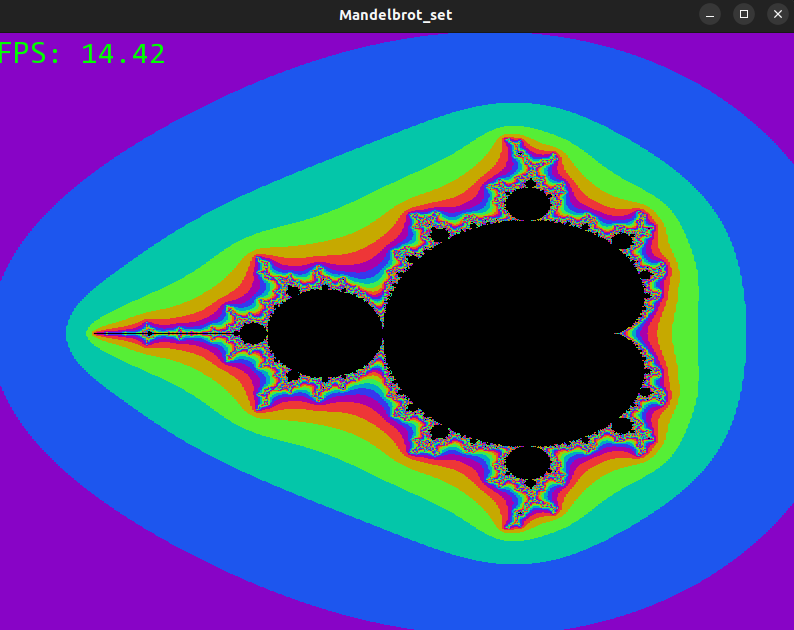
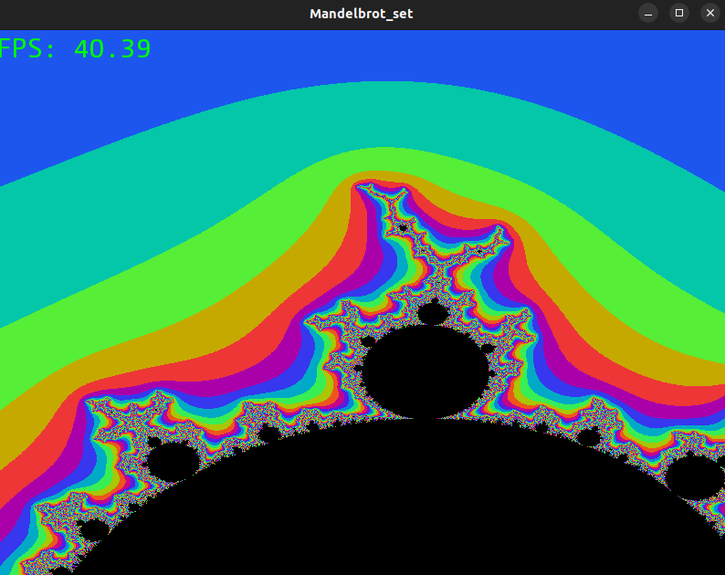
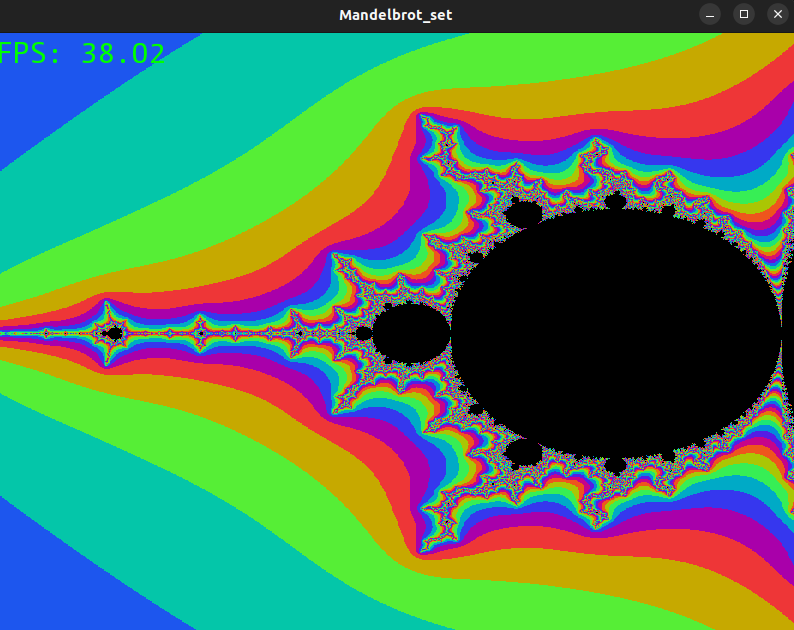

# Mandelbrot set
The program is free-to-use for all kinds of developers.

***
## What does the project do
This is a program showing Mandelbrot set written on C++ language. [SFML library](https://www.sfml-dev.org/) was used for
displaying the result on the screen.

***
## Why is the project useful
The goal is to train to optimize program using intrinsics (also SIMD instructions, SSE) and to see how the performance grows with this usage (FPS counter
is drawn at the top left corner of the window). Therefore, two versions of program were written: one without intrinsics and one with them.
If drawing mode is not chosen then FPS counter is being outputted to the console.

***
## How to launch
1. No intrinsics usage
```c++
   $ git clone https://github.com/kirilliliych/Mandelbrot_set.git
   $ make -f makefile_no_SSE
```
2. With intrinsics
```c++
   $ git clone https://github.com/kirilliliych/Mandelbrot_set.git
   $ make -f makefile_SSE
```

***
## Functionality
### Keys:
- Zoom in:  X
- Zoom out: Z
- Move picture up:    W
- Move picture down:  S
- Move picture right: D
- Move picture left:  A

### Note:
Both in [cpp_no_SSE](Mandelbrot_set_no_SSE.cpp) and [cpp_SSE](Mandelbrot_set.cpp) files it is possible to toggle conditional compilation to enable either
massive calculations of Mandelbrot set that load the program or just drawing the picture.

***
## Screenshots




***
## How can I help
I explicitly welcome any outside contributors. Use my mail: _ilichev.kv@phystech.edu_.

__A strong request__:
* Do not break the codestyle
* Do not destroy previous functionality with additions

***
## Where to ask questions
Use the mail mentioned earlier.

